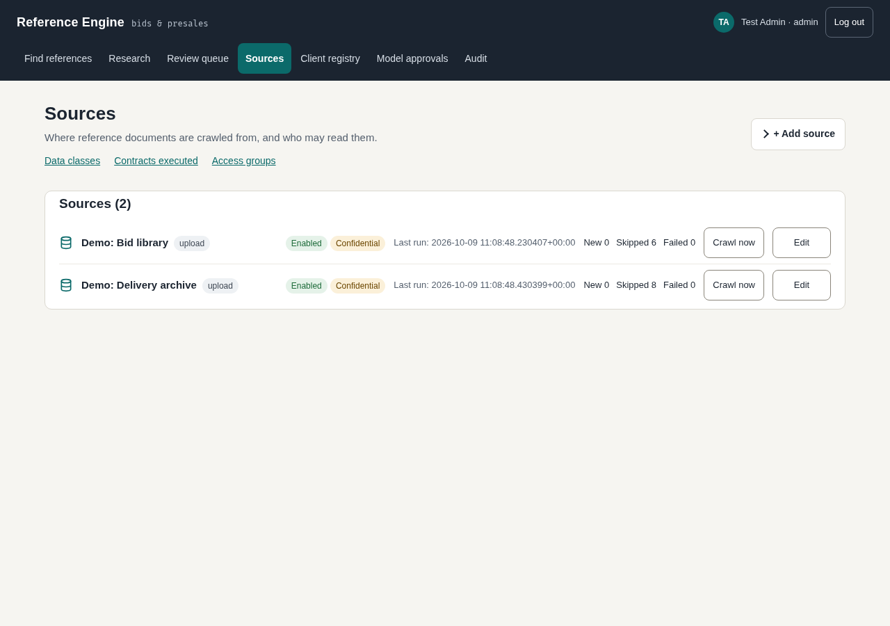
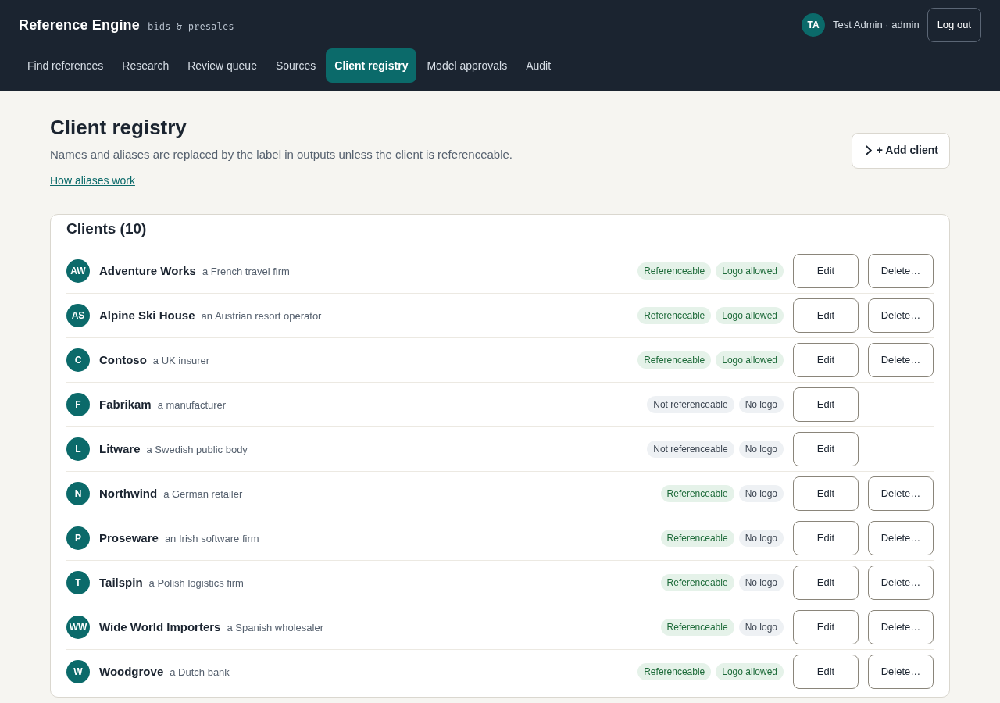
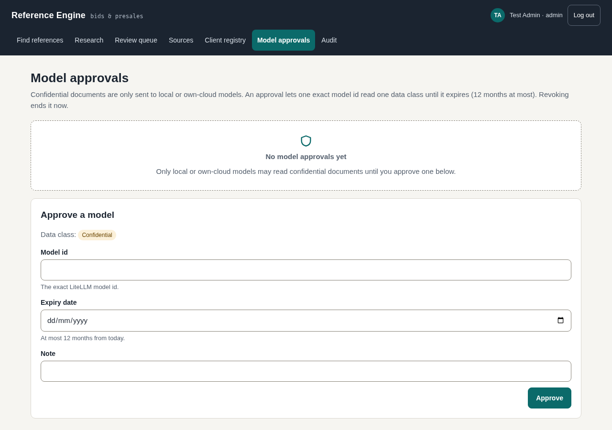
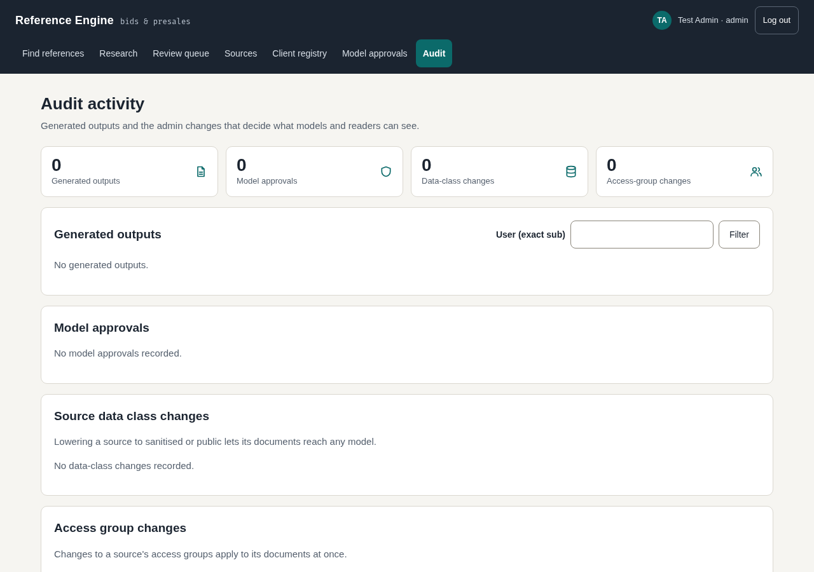

# Admins

For people who run the portal's content: sources, client names, approved models and the audit trail.
Admins can also do everything [reviewers](reviewers.md) and the [bid team](bid-team.md) can.

## Manage sources



**What it's for**

Choosing where reference documents are crawled from, and who may read them.

**Steps**

1. Open **Sources**.
2. To add one, open **+ Add source**, fill in **Kind**, **Name**, **Config (JSON)**, **Data class** and **Access groups**, and press **Add source**.
3. To change one, press **Edit** on its row, then **Save**.
4. Open the help panels on the page when unsure:
   - **Access groups**: the groups whose members can read the source. SharePoint files whose permissions differ from the site root, and Confluence pages with a read restriction, are skipped by the crawl. Enter only groups that can read all of the site or space.
   - **Data classes**: confidential documents only go to local or own-cloud models unless a model is approved. Mark a source sanitised or public only when that is true.
   - **Contracts executed**: tick it only when every statement of work or change order in the source is signed.

**What you see**

A row per source with its kind, whether it is enabled, its data class and when it last ran.

## Crawl a source

**What it's for**

Pulling in new documents without waiting for the schedule.

**Steps**

1. Press **Crawl now** on the source's row.
2. Press **Edit** to see **Last run counts** after it finishes.

**What you see**

The row shows New, Skipped and Failed counts for the last run. "Skipped" includes files left out
because of their permissions or restrictions.

## Upload a document

**What it's for**

Adding a single file to an upload source.

**Steps**

1. Add a source with **Kind** `upload` and **Config (JSON)** such as `{"bucket": "example-bid-library", "prefix": "cases/"}`.
2. On that source's row, press **Upload**, choose the file, and press **Upload** again.

Scripts can send the file instead. The curl option `-b cookies.txt` reads your signed-in session cookie
(copy it from your browser into that file); `source_id` is optional, and without it the file goes to the
first enabled upload source. Replace `localhost:8000` with your portal address:

```
curl -b cookies.txt -H 'Origin: http://localhost:8000' \
  -F file=@sample-case.docx -F source_id=1 http://localhost:8000/admin/upload
```

**What you see**

Back on the Sources page, a line saying the file was queued for crawl, with the job number and source.
The document is crawled shortly after. Only `.docx`, `.pptx` and `.pdf` files are accepted; a refused
file shows the reason instead. A script gets a reply with the job number.

## Client registry



**What it's for**

Deciding which client names are hidden in outputs and which may be shown.

**Steps**

1. Open **Client registry**.
2. To add a client, open **+ Add client**, fill in **Name**, **Aliases (one per line)** and **Label in outputs**, tick **Referenceable** or **Logo allowed** if they apply, and press **Add client**.
3. To change one, press **Edit**, then **Save**.
4. Open **How aliases work** for advice on aliases.

**What you see**

Each client with its label and badges. Names and aliases are replaced by the label in outputs unless
the client is referenceable.

## Model approvals



**What it's for**

Allowing a specific AI model to read confidential documents.

**Steps**

1. Open **Model approvals**.
2. Under **Approve a model**, fill in **Model id**, **Expiry date** (at most 12 months away) and a **Note**.
3. Press **Approve**.
4. To end an approval early, press **Revoke** on its row.

**What you see**

A table of approvals, "Active" or "Expired", with who approved each and when it expires.

## Audit



**What it's for**

Seeing who generated what, and which admin changes were made.

**Steps**

1. Open **Audit**.
2. Read **Generated outputs**. To look at one person, type their id in **User (exact sub)** and press **Filter**.
3. Use **« newer** and **older »** to page through.
4. Further down are **Model approvals**, **Source data class changes** and **Access group changes**.

**What you see**

A row per download with its time, format, user, cases, whether it was anonymised and the
**Industry-only ack** column, which says whether the user acknowledged an industry-context download.
