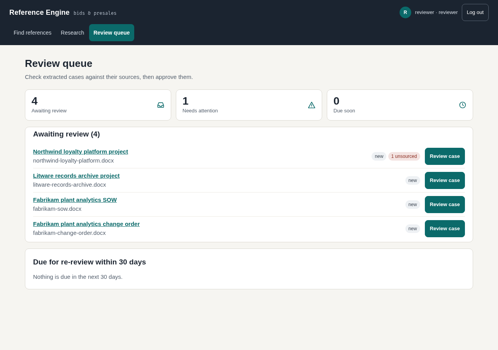
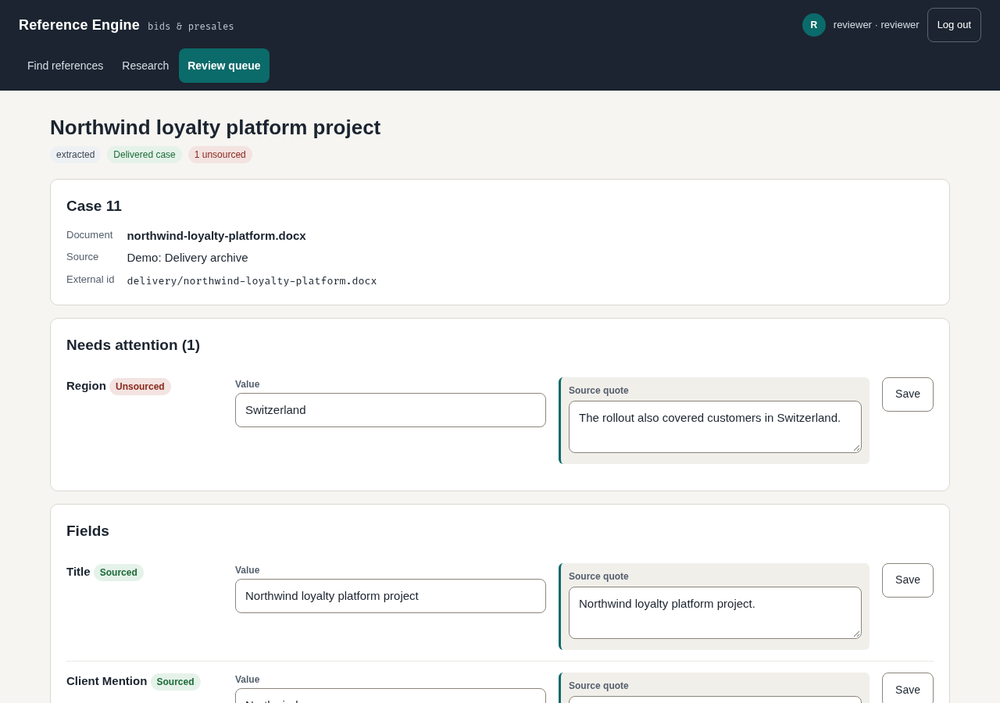

# Reviewers

For people who check extracted cases against their sources before they can be used in bids.
Reviewers can also do everything the [bid team](bid-team.md) can.

## Work through the queue

**What it's for**

Seeing which cases need a decision.

**Steps**

1. Open **Review queue**.
2. Look at **Awaiting review**, **Needs attention** and **Due soon** at the top.
3. In the list, each case shows "new" or "re-review due", and how many notes or unsourced fields it has.
4. Press **Review case** on the one you want.

**What you see**

A list of cases with a title and the document or number of contracts behind each. When there is
nothing to do, the page says "Nothing to review".

## Sourced and unsourced fields

**What it's for**

Knowing which facts are backed by the source document.

**Steps**

1. On a case page, read the **Needs attention** box above **Fields**: it lists the fields that need a look first. Then read the **Fields** section.
2. Check the badge on each field: "sourced", "unsourced", "empty", or "no quote (generated)".
3. Compare the value with its **Source quote**.

**What you see**

A field is "sourced" when its quote is found in the document. An "unsourced" field has a value the
document does not back up.

## Edit a field

**What it's for**

Fixing a value or its quote.

**Steps**

1. Change the value, or the text in **Source quote**.
2. Press **Save** on that row.

**What you see**

The page reloads with the new value, and the badge shows whether it is now sourced.

## Add or remove list items

**What it's for**

Fixing lists such as capabilities, technologies and outcomes.

**Steps**

1. To add an item, fill in the empty row at the end of the list, with its quote, and press **Add**.
2. To drop an item, press **Remove** on its row.

**What you see**

The list shows the change after the page reloads. A blank item is refused.

## Decide: approve or reject

**What it's for**

Letting a case into search, or turning it down.

**Steps**

1. Under **Decision**, read the warning: "Approving empties every unsourced field. Check the quotes first."
2. Press **Approve (unsourced fields are emptied)** when the case is good, or **Reject** when it is not.

**What you see**

An approved case can appear in search. Unsourced fields are emptied on approval, so fix or source
them first. A rejected case does not appear in search.

## Add a client name

**What it's for**

Protecting a client name that the registry does not know yet. Admins only: you see this
button only if you are also an admin.

**Steps**

1. When a case page says "organisation not in client registry", type a label such as "a retail bank".
2. Press **Add as client**.

**What you see**

The name is added to the registry and hidden in outputs. Use it for clients only. A partner or
vendor added here is hidden in every output.

## Merge contracts

**What it's for**

Joining several contracts for the same client into one case.

**Steps**

1. On a case page, under "Merge with other contracts for the same client", tick the contracts to join.
2. Press **Preview merge**.
3. On **Merge contracts**, look at **Differing fields** and choose which contract each value comes from.
4. Press **Merge**.
5. To undo, open the merged case and press **Un-merge (the contracts go back to the queue)**.

**What you see**

One new case that needs a new summary and a fresh approval. Capabilities and technologies are
combined and outcomes are dropped.

## Re-review

**What it's for**

Keeping approvals current. An approval expires after 12 months and the case leaves search until it is
approved again.

**Steps**

1. Check **Due for re-review within 30 days** on the queue page.
2. Open each case and review it as above.

**What you see**

Each due case shows when it expires. Cases already expired appear in the main list as "re-review due".
